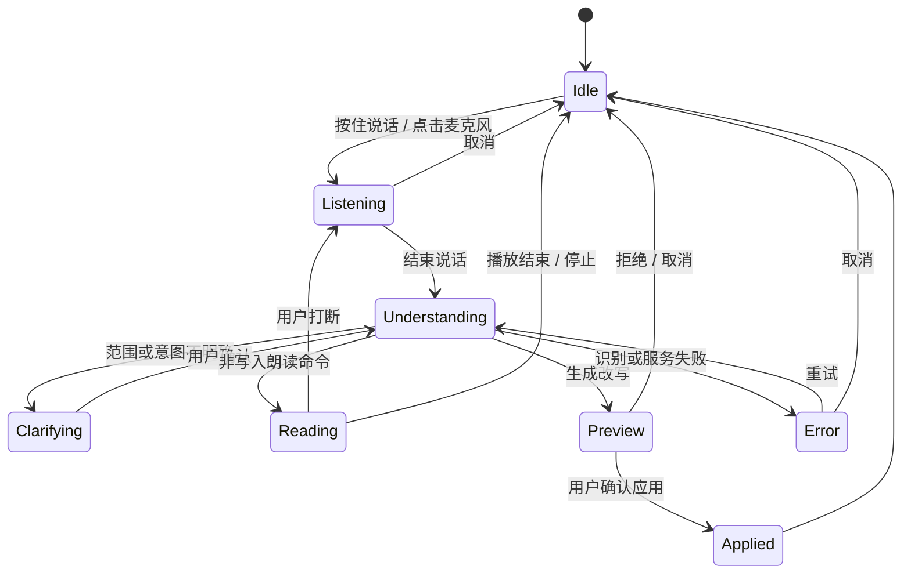
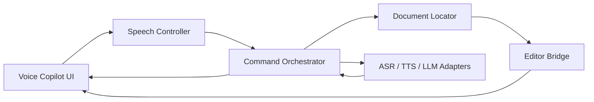

# Top Writer 语音副驾产品设计

- 日期：2026-07-11
- 状态：交互方案已确认，书面规格待用户复核
- 首发用户：中文长文创作者
- 首发平台：桌面版 Chrome

## 1. 产品结论

Top Writer 增加一个常驻的“语音副驾”。用户先输入或粘贴文章，再通过语音完成朗读、定位、讨论和改写。主闭环是：

> 听文章 → 口述指令 → 明确目标范围 → 预览差异 → 确认应用 → 随时撤回

MVP 不追求全程免键盘，也不把编辑器变成一个自由聊天窗口。它优先解决三个高价值任务：

1. 按全文、选择、当前段或相邻段落朗读，并同步高亮。
2. 用自然语言找到“讲某个意思”的段落，并让用户确认目标。
3. 对已确认范围口述改写要求，先看和听新版本，再决定是否应用。

任何正文修改都必须经过显式确认。模型可以提出改动，但只有编辑器桥接层能写入文档。

## 2. 社区与竞品调研

### 2.1 已被验证的模式

- Wispr Flow 将普通听写与 AI 编辑命令分开；选中文本后，语音命令才作用于该范围。这说明“模式与作用域可见”比让模型自由猜测更可靠。[Wispr Flow Command Mode](https://docs.wisprflow.ai/articles/4816967992-how-to-use-command-mode)
- Microsoft Voice Access 使用“选中某短语”“从 A 到 B”等分层语法；同一短语多次出现时显示编号让用户二次确认。这适合 Top Writer 的段落定位。[Microsoft Voice Access](https://support.microsoft.com/en-US/accessibility/windows/voice-access/select-text-with-voice)
- Word Immersive Reader 把逐词高亮、暂停、语速和音色作为朗读的一部分，说明长文 TTS 必须同时提供可见定位和播放控制。[Microsoft Word Immersive Reader](https://support.microsoft.com/en-us/accessibility/word/use-immersive-reader-in-word)
- Google Docs 支持中文听写，但语音编辑和格式化命令仍主要面向英文，中文原生的“找段—听读—改写”仍有明显产品空间。[Google Docs Voice Typing](https://support.google.com/docs/answer/4492226?hl=en)
- 关于语音与写作的研究表明，对话式语音反馈有助于作者追问、反思并进行实质性修订；它更适合成为修改的起点，而不是替作者自动定稿。[Voice Interaction With Conversational AI](https://arxiv.org/abs/2504.08687)、[Speakerly](https://arxiv.org/abs/2310.16251)
- 中文创作者已经在采用“语音口述 + AI 访谈/整理”的工作流，说明需求不只来自无障碍场景，也来自内容生产效率。[B 站：语音口述与 AI 写作工作流](https://www.bilibili.com/video/BV1t1qaBaECC)

### 2.2 社区反复出现的失败模式

- 用户最难接受的是状态不透明：启动后漏掉第一个词、转写浮层卡住、取消无响应，以及失败后不知道内容是否保存。[Wispr reliability update](https://www.reddit.com/r/WisprFlow/comments/1tx06rk/reliability_and_accuracy_update_what_happened/)
- 中断恢复是核心需求。产品后续加入中断通知、历史复制和失败重试，反向证明长听写或复杂命令不能静默丢失。[Wispr product update](https://www.reddit.com/r/WisprFlow/comments/1u9jjhj/june_18_2026_product_updates_reliability_privacy/)
- 中文用户集中反馈中英混输、品牌和人名误识别、中文标点不稳定、偶发繁体字、背景噪声幻觉，以及不能从人工纠错学习。[X：中文语音输入实测](https://x.com/lexrus/status/2036442682017587460)、[X：中英混输实测](https://x.com/LinearUncle/status/1832313097576645015)
- 用户希望一边说一边看见转写；完全隐藏中间结果会增加长文场景的不确定感。[Reddit：希望实时显示听写](https://www.reddit.com/r/WisprFlow/comments/1rk9z0r/feature_request_see_dictated_text_while_speaking/)
- 固定“魔法口令”经常被误当成正文。Google Docs 与 Gboard 社区中反复出现命令不执行、段落命令失灵和命令列表不完整的问题。[Reddit：Google Docs 命令失效](https://www.reddit.com/r/googledocs/comments/1fj4okm)、[Reddit：Gboard 命令列表](https://www.reddit.com/r/gboard/comments/fojmic)

### 2.3 对本产品的直接含义

1. 实时显示转写和当前状态，不使用只靠声音反馈的黑盒交互。
2. 固定范围命令走确定性规则；语义定位返回候选，不让模型暗猜目标。
3. 中英混输、姓名、品牌、数字、标点、长停顿和背景噪声必须进入首批评测集。
4. Esc、停止按钮和新的语音输入都能立即打断当前朗读或请求。
5. 键盘和鼠标始终可接管；语音是更快的操作方式，不是唯一入口。
6. 连续长篇口述写入不进入首发范围，避免听写内容与编辑命令互相混淆。它可作为后续独立模式设计。

## 3. 目标与非目标

### 3.1 MVP 目标

- 让用户在真实长文中完成“听—找—改—撤回”，无需记忆固定命令表。
- 让用户始终知道系统是空闲、聆听、理解、朗读、生成、等待确认还是失败。
- 对任何可能改动正文的操作提供明确范围和差异预览。
- 普通话优先，支持常见中英混读和自定义词表。
- 保持供应商可替换，不让 ASR、TTS 或 LLM 绑定 UI 与编辑器逻辑。

### 3.2 MVP 非目标

- 持续常开麦克风、唤醒词或完全免按键控制。
- 连续长篇语音听写成稿。
- 系统级跨应用输入。
- 多角色配音、播客制作或音色市场。
- 跨文档知识库问答。
- 多人实时协作中的语音冲突处理。
- 未经确认的自动改稿。

## 4. 核心交互

### 4.1 页面布局

现有编辑器保持主画布。新增两块界面：

1. 画布底部的紧凑播放条：上一段、播放/暂停、下一段、语速、当前范围。
2. 右侧常驻语音副驾：麦克风、实时转写、解析结果、澄清问题、Diff 预览和确认按钮。

播放时正文同步高亮当前句；浏览器不提供可靠词边界时，降级为句级高亮，不伪造逐词同步。

### 4.2 状态机



每个状态都必须同时提供可见标签和可执行的下一步。聆听状态使用持续但克制的视觉提示；处理中不得继续接收会写入正文的新命令，但允许取消。

### 4.3 支持的意图

| 意图 | 示例 | 是否修改正文 | 是否需要确认 |
| --- | --- | --- | --- |
| `READ` | “从头读”“读上一段”“读选中的内容” | 否 | 否 |
| `CONTROL` | “暂停”“继续”“快一点”“停止” | 否 | 否 |
| `LOCATE` | “找到讲用户信任的地方” | 否 | 多候选时确认范围 |
| `REWRITE` | “这段更直接一点，保留最后一句” | 是 | 必须预览确认 |
| `UNDO` | “撤回刚才的改动” | 是 | 展示将恢复的上次差异，确认后撤回 |

复合口述最多拆成三个有序动作。例如“找到讲用户信任的那段，读一下，再改得更直接”会被拆为 `LOCATE → READ → REWRITE`。遇到多个候选时流程暂停；确认范围后才继续后续动作。

### 4.4 范围解析优先级

范围必须落成确定的文档坐标，优先级如下：

1. 用户当前选区。
2. 当前正在朗读或刚刚朗读的段落。
3. 当前光标所在段落。
4. 明确相对范围：上一段、下一段、前两段。
5. 明确序号：第 5 段。
6. 语义范围：讲“定价”“信任”“案例”的部分。

语义范围返回最多三个候选。若第一名没有明显领先，副驾高亮候选并各朗读一句，再问一个问题，例如“你指第 6 段还是第 9 段？”

### 4.5 改写预览

- 预览显示原文、新文和词级差异。
- 提供“朗读原文”“朗读新版”“应用”“重试”“保留原文”。
- 预览不写入编辑器正文；它只存在于副驾面板。
- 用户点击“应用”后，Editor Bridge 用一个 Tiptap 事务替换目标范围。
- 每次应用进入原生撤回历史，并额外提供可见的“撤回刚才改动”。
- 语音撤回先展示上次改动的反向差异；用户确认后执行，并保留再次恢复的能力。
- 预览生成后若正文版本发生变化，预览立即标记过期，禁止应用并要求重新生成。

## 5. 架构



### 5.1 模块职责

#### Voice Copilot UI

只负责展示和用户输入：麦克风状态、实时转写、播放条、范围确认、错误恢复和 Diff 预览。它不直接读取或修改 Tiptap。

#### Speech Controller

封装录音、ASR 生命周期、TTS 队列、暂停、打断、语速和高亮时间轴。它只暴露领域事件，例如 `partialTranscript`、`finalTranscript`、`playbackBoundary` 和 `speechError`。

#### Command Orchestrator

维护状态机，把转写解析为结构化动作并按顺序执行。它负责置信度阈值、澄清策略、取消和超时，但不直接访问编辑器内部结构。

结构化结果至少包含：

```ts
interface VoicePlan {
  transcript: string;
  confidence: number;
  actions: VoiceAction[]; // 最多 3 个
}

interface VoiceAction {
  intent: 'read' | 'control' | 'locate' | 'rewrite' | 'undo';
  scope: VoiceScope | null;
  constraints: string[];
}
```

#### Document Locator

接收文档段落快照和范围表达，返回零到三个候选。固定范围使用确定性代码；只有语义范围才调用模型或语义检索。该模块不能修改文档。

#### Editor Bridge

这是唯一拥有 Tiptap 写权限的语音模块。它提供窄接口：

- 获取文档段落快照、光标、选区和版本号。
- 高亮或滚动到确定范围。
- 读取目标范围及必要的相邻上下文。
- 对原文与候选文本计算 Diff。
- 在版本校验通过后用单个事务应用替换。
- 撤回最近一次已确认的语音改动。

文档版本号在每个 Tiptap 文档事务后递增。范围解析和改写预览都记录生成时的版本号；版本不一致时一律重新解析，不尝试把旧位置映射到新文档。

#### Provider Adapters

ASR、TTS 和 LLM 使用统一接口。首发实现面向桌面 Chrome：

- ASR：浏览器语音识别能力，提供实时中间结果。
- TTS：浏览器 `speechSynthesis`，按句和段落切块。
- LLM：复用 Top Writer 已配置的模型路径。

自定义词表首先用于最终转写后的确定性术语归一化，并作为 LLM 理解命令的上下文。若将来的 ASR 供应商支持热词提示，适配器可以同时下发词表；首发不依赖该能力。

不支持相应浏览器能力时，界面明确说明环境限制并保留文本指令入口。后续可换云端语音服务，而不改 Orchestrator、Locator 或 Editor Bridge。

### 5.2 与现有代码的接入

- `src/components/wordflow/wordflow.ts` 只负责挂载副驾组件和连接顶层事件。
- `src/components/text-editor/text-editor.ts` 已包含 Tiptap 选区、Diff 和历史能力，但文件较大；语音状态机不能继续写入该文件。
- 新建独立 Editor Bridge，将现有编辑器能力包装成稳定接口。
- `src/components/text-editor/text-diff.ts` 的差异计算可以复用，但预览渲染在副驾面板，确认前不向正文插入编辑标记。
- `src/llms/*` 通过适配器复用。语音命令只发送目标段落、必要邻接上下文和改写约束，不默认发送全文。

### 5.3 数据流示例

“找到讲用户信任的那段，读一下，再改得更直接”：

1. Speech Controller 输出实时转写和最终转写。
2. Orchestrator 解析为 `LOCATE → READ → REWRITE`。
3. Editor Bridge 提供只读段落快照。
4. Locator 返回第 6、9 段两个候选。
5. UI 高亮候选并逐一朗读一句；用户确认第 6 段。
6. TTS 朗读第 6 段。
7. LLM 只接收第 6 段、相邻上下文和“更直接”的约束。
8. Editor Bridge 计算 Diff，UI 展示并可朗读新版。
9. 用户确认后，Editor Bridge 校验文档版本并用一个事务应用。
10. UI 显示“已应用，可撤回”。

## 6. 安全、隐私与恢复

### 6.1 写入规则

- 朗读、暂停、调速、定位和取消可直接执行。
- 所有增删改正文的操作都必须先预览。
- 文档版本变化会使旧预览失效。
- 低置信度转写不能触发正文操作。
- 打断、取消、超时和网络失败均不得产生正文写入。

### 6.2 数据边界

- 完整文档、编辑历史、选区和最终应用决定留在浏览器。
- ASR 只处理本次语音片段；原始音频默认不持久化。
- TTS 只接收当前要朗读的文本块。
- LLM 只接收目标范围、必要邻接上下文和改写约束。
- 本地可保存命令类型、范围和操作结果，方便撤回；不默认保存原始音频。
- 若浏览器语音服务会把音频交给浏览器供应商处理，首次使用时必须清楚披露。
- 产品分析只记录匿名的意图类别、延迟、成功/失败和取消原因，不收集正文、转写内容或音频。

### 6.3 异常恢复

| 异常 | 用户反馈 | 系统行为 |
| --- | --- | --- |
| 麦克风未授权 | 展示一次明确的开启步骤和文本指令入口 | 不反复弹权限请求 |
| ASR 听不清 | 保留实时转写，允许改一句或重说 | 低置信度内容不执行 |
| 多个范围候选 | 高亮并朗读候选 | 只追问一个范围问题 |
| 网络或模型超时 | “未修改正文，可重试” | 保留范围和指令，取消旧请求 |
| TTS 失败 | 显示错误并保留文本高亮 | 停止播放队列，可切换可用浏览器声音重试 |
| 预览后正文变化 | “预览已过期” | 禁止应用旧 Diff |
| 用户打断 | 立即停止声音并显示新的转写 | 中止 TTS 和 LLM 请求，不写正文 |
| 页面刷新 | 恢复已保存文档，不恢复未确认预览 | 清除临时音频和进行中的请求 |

## 7. 质量指标

| 指标 | MVP 门槛 | 测量方法 |
| --- | --- | --- |
| 麦克风状态反馈 | 小于 150 ms | UI 事件到状态可见时间 |
| 首个实时转写 | 小于 1 秒 | 开始说话到首个 partial result |
| 朗读开始 | 小于 1.5 秒 | 发出 READ 到首个声音 |
| 固定范围命令正确率 | 至少 95% | 标准命令集 |
| 语义找段 Top-3 命中率 | 至少 90% | 中文长文评测集 |
| 未确认正文写入 | 0 次 | 自动化和真人测试 |
| 撤回完整还原率 | 100% | 文档 JSON 前后对比 |
| 核心任务成功率 | 至少 90% | 真人“听—找—改—撤回”任务 |

首批中文语音评测必须覆盖中英混输、姓名、品牌、术语、同音词、数字日期、中文标点、长停顿、自我纠正和背景噪声。

## 8. 测试策略

### 8.1 单元测试

- 状态机的所有合法和非法转换。
- `VoicePlan` 结构校验、动作上限和置信度门槛。
- 固定范围解析和候选排序。
- TTS 的句段分块、暂停、恢复和打断。
- 文档版本校验和预览过期判断。

### 8.2 集成测试

- 选区或段落 → Diff → 确认 → 单事务应用 → 撤回。
- 复合动作在澄清处暂停并在确认后继续。
- ASR、TTS 和 LLM 适配器使用固定假实现，验证超时、取消和重试。
- 编辑器变化使旧预览失效。

### 8.3 端到端测试

至少覆盖以下 12 条旅程：全文朗读、选择朗读、上一段、下一段、暂停恢复、打断、语义找段、多个候选澄清、单段改写、复合找读改、拒绝预览、应用后撤回。另测权限拒绝、断网、模型超时和页面刷新。

自动化测试使用录制的转写事件，不依赖真实麦克风。浏览器语音能力另做 Chrome 人工验收。

### 8.4 真人验证

邀请 8–12 名中文长文创作者，使用自己的 1,500–5,000 字文章完成：

1. 从指定位置开始听。
2. 找到一个只描述了含义、未给原句的段落。
3. 口述改写约束并比较新旧版本。
4. 应用后撤回。

记录任务成功率、完成时间、追问次数、误定位次数、取消原因和主观信任评分。公开测试的门槛是核心任务成功率至少 90%，且未确认写入为零。

## 9. 交付顺序

1. **朗读纵切片**：Editor Bridge 只读能力、段落范围、TTS、播放条和高亮。
2. **语音控制**：ASR、实时转写、状态机、暂停/继续/跳段/打断。
3. **语义定位**：候选段落、高亮、朗读一句和单问题澄清。
4. **安全改写**：结构化计划、目标片段生成、独立 Diff 预览、版本校验、应用和撤回。
5. **复合命令与加固**：`LOCATE → READ → REWRITE`、故障恢复、中文评测和真人测试。

每一步都形成可演示、可测试的垂直功能，不需要等全部模块完成后才验证体验。

## 10. 已确认的产品决策

- 首发服务中文长文创作者。
- 采用“语音副驾”，不是纯播放器或全语音自由对话。
- 主闭环是“先听—口述—预览—确认”。
- 所有正文修改一律先预览。
- 普通话优先，支持中英混读和自定义词表。
- 完整文档与编辑历史留在浏览器。
- 模型只拿到完成当前任务所需的最小文本范围。
- MVP 首发平台是桌面 Chrome。
- 连续长篇口述写入、全局输入和持续监听延后。
